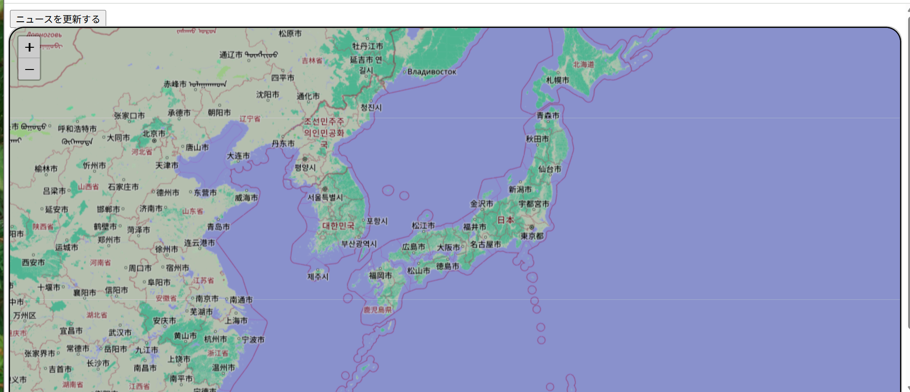
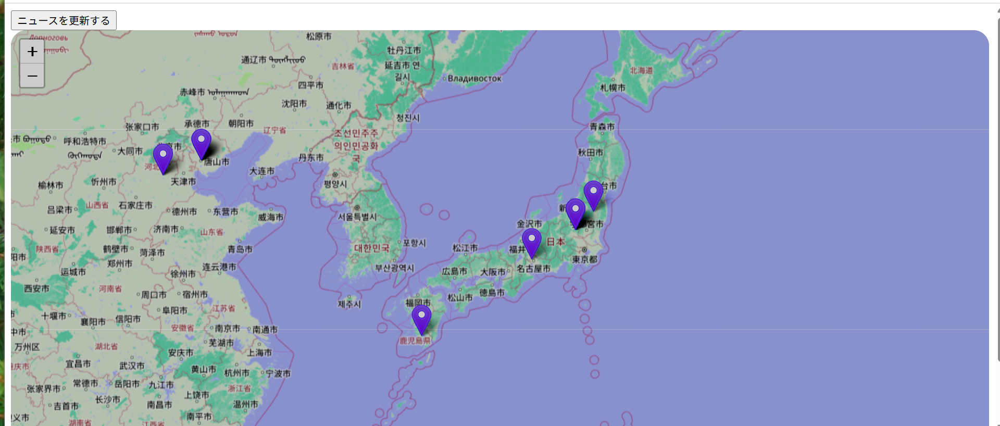
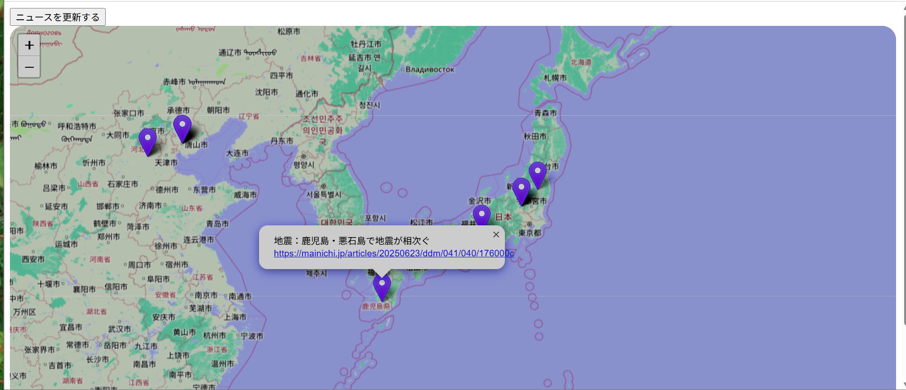
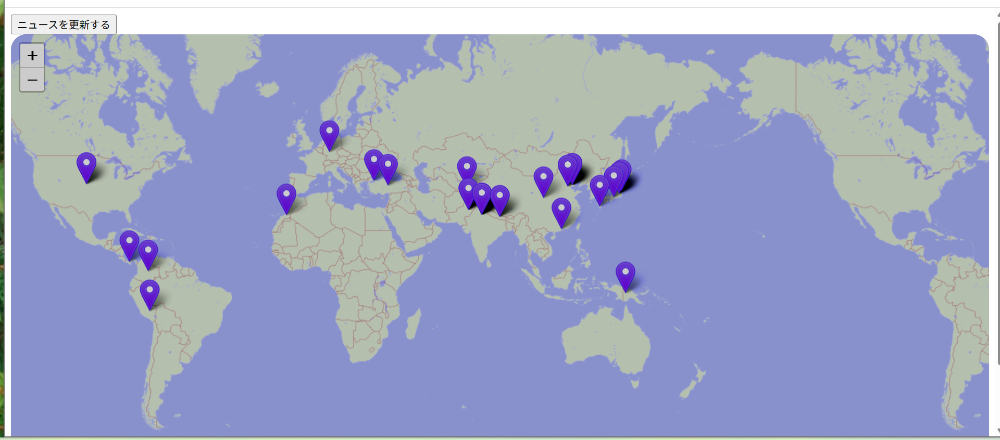
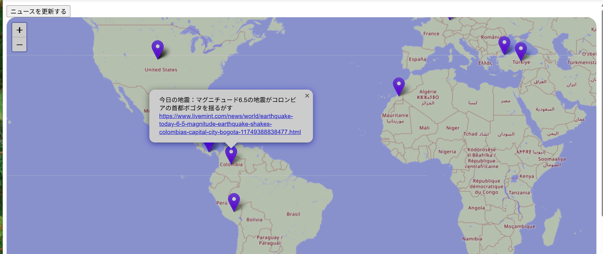
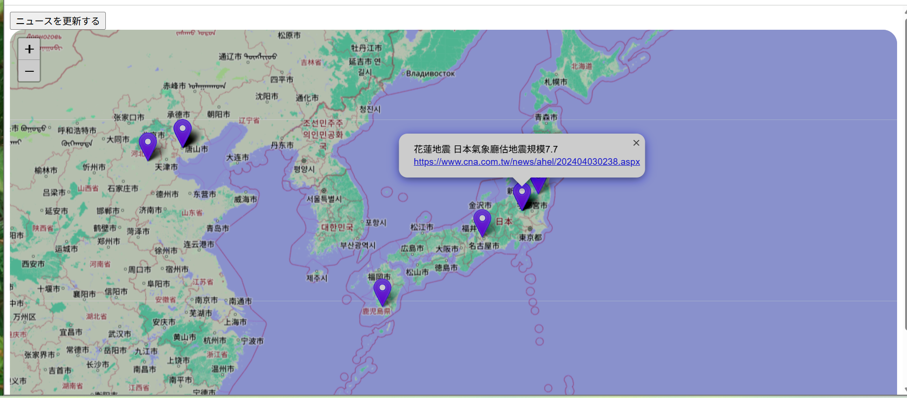

# README

## アプリ概要

日本や海外の地震に関するニュースを自動で取得し、地図上の該当地域にピン表示させるアプリです。

## 制作背景

文章だけで色々な情報を探すよりも、地図として見られる方がどこで何が起きているのかを把握しやすいのではないかと考え、このアプリの開発に挑戦しました。

始めはニュースではなくtwitter上の投稿を取得し地図と連携させるようなアプリを構想していましたが、情報の信頼性や正確性という面を考慮するとニュースを情報源にした方が良いのではないかと考え、ニュースAPIを利用することにしました。

ニューステーマをどんなものにするかについてもいろいろな案を模索していましたが、どこで地震が起きているのか把握するようなアプリは、地図との連携という特徴が役立つと考え、地震をテーマにしました。

## 使用技術

html,css,ruby,ruby on rails,mecab,mymemory api,openstreetmap,nominatim api

## 機能一覧

・地震に関するニュースの自動取得

・地図と連携し、ニュースの該当地域にピン表示

・ピンクリックで日本語のニュースタイトルとurlを表示

## 使用方法

アプリにアクセスすると、このような画面が表示されます。
左上の「ニュースを更新する」ボタンをクリックすると、ニュースの取得が始まります。

しばらくするとニュースの取得が終わり、地震に関するニュースが地図上にピン表示されます。

鹿児島県にあるピンをクリックしてみると、「地震：鹿児島・悪石島で地震が相次ぐ」というニュースタイトルと、記事のurlが表示されています。

日本以外の地域のニュースも、ある程度集めてくることができます。

コロンビアにあるピンをクリックしてみると、「今日の地震：マグニチュード6.5の地震がコロンビアの首都ポゴタを揺るがす」というニュースタイトルと、記事のurlが表示されています。

## 問題点

現在の処理では「地震」のワードを含んだニュースも取得しますが、この方法では中国語のニュースも対象になってしまいます。英語以外のタイトルは翻訳することができないため、結果として中国語のタイトルがそのまま表示されてしまいます。

ニュースAPIを利用しているため情報の信頼性は確保されていますが、数年前の大きな地震について取り上げた記事なども存在するため、必ずしもリアルタイムな情報の取得ができるわけではありません。

## 今後の改善点

・ニュースのフィルタリング機能の実装

・地名検索機能の実装
